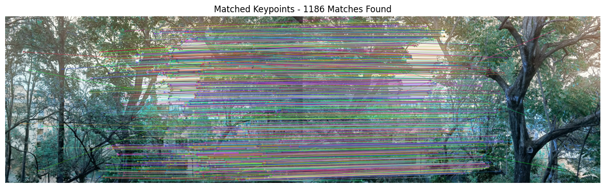

git add .
git commit -m "sdf"
git push -u origin main

 
Coin Detection and Counting

Overview

This project focuses on detecting and counting coins in an image using various edge detection techniques, including:

Sobel Edge Detector

Prewitt Edge Detector

Marr-Hildreth Edge Detector

Canny Edge Detector

Each method is used to identify edges in the image, and contours are extracted to outline and count the number of coins.

Requirements

To run this project, you need the following dependencies:

Python 3.x

OpenCV

NumPy

Matplotlib

Install the required packages using:

pip install opencv-python numpy matplotlib

Usage

1. Detecting Coins Using First Order Derivative Edge Detectors (Sobel & Prewitt)

python first_order_edge_detection.py

This script performs Sobel and Prewitt edge detection and outlines the detected coins.

2. Detecting Coins Using Marr-Hildreth Edge Detector

python marr_hildreth_edge_detection.py

This script applies the Marr-Hildreth (Laplacian of Gaussian) edge detector and highlights the coins.

3. Detecting Coins Using Canny Edge Detector

python canny_edge_detection.py

This script applies the Canny edge detector and outlines the detected coins.

4. Counting the Total Number of Coins

python count_coins.py

This script processes the image, extracts contours, and counts the number of coins.

Edge Detection Techniques Used

Sobel Edge Detector

Less sensitive to noise.

Produces smooth gradients.

Good for detecting fine edges.

Prewitt Edge Detector

More sensitive to noise.

Faster but less accurate than Sobel.

Produces strong contrasts in edges.

Marr-Hildreth Edge Detector

Produces one-pixel-thick edges.

Detects true edges with minimal error.

May result in broken edges.

Canny Edge Detector

Produces less broken edges.

Generates one-pixel-thick edges.

Detects true edges with minimal error.

Results and Observations

Sobel and Prewitt detect edges efficiently, but Prewitt is more sensitive to noise.

Marr-Hildreth produces clear, thin edges but can have broken edges.

Canny provides the best results with minimal noise and well-defined edges.

The final step counts the number of coins accurately using contour filtering.

Example Output

Detected coins: X (Number of coins found in the image)

Author

Developed by: [Your Name]

